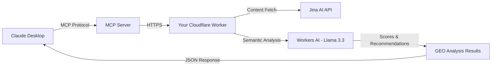

# 🚀 GEO Analyzer MCP

<div align="center">

[](https://www.npmjs.com/package/@houtini/geo-analyzer)
[](https://deploy.workers.cloudflare.com/?url=https://github.com/houtini-ai/geo-analyzer)
[](https://opensource.org/licenses/MIT)
[](https://nodejs.org/)

**Analyze how well your content performs in AI-generated responses.**

Powered by Model Context Protocol (MCP), this tool brings professional GEO analysis directly into Claude Desktop. Get real-time extractability scores, semantic analysis, and actionable recommendations—all while maintaining complete control over your infrastructure.

### Why This Matters

**🎯 Private & Powerful**: Deploy your own Cloudflare Worker—your data never touches third-party servers  
**🧠 Smart Analysis**: Leverage Jina.ai's Reader API for pristine content extraction and Cloudflare Workers AI for semantic triple detection  
**⚡ Flexible Models**: Choose from Llama 3.3 70B, Mistral, or other models—switch anytime  
**📊 MCP Integration**: Native Claude Desktop tool—no copy/paste, no context switching  
**🔧 Full Control**: Your Worker, your API keys, your rate limits, your audit logs

</div>


*Claude analyzing a page and providing actionable GEO recommendations*

---

## 🌟 What You Get

### MCP-Powered Analysis in Claude Desktop

Talk naturally to Claude and get instant GEO analysis—no switching contexts, no external tools, no manual work.

**Three Powerful Tools at Your Command:**
- **`analyze_url`**: Deep-dive analysis of any webpage with extractability scoring, semantic analysis, and prioritized recommendations
- **`compare_extractability`**: Side-by-side comparison of up to 5 URLs to benchmark against competitors
- **`validate_rewrite`**: Before/after comparison proving your content improvements with percentage changes

### Technology Stack That Works for You

**🔍 Content Extraction**: [Jina.ai Reader API](https://jina.ai/) strips away clutter and returns pristine markdown—1M tokens free per month  
**🤖 Semantic Analysis**: Cloudflare Workers AI with Llama 3.3 70B extracts semantic triples, entities, and relationships  
**⚙️ Pattern Analysis**: Custom regex-based scoring measures claim density, sentence structure, and temporal markers  
**🔌 MCP Protocol**: Native integration with Claude Desktop via Anthropic's Model Context Protocol  

### Analysis Features

**Extractability Scoring (0-10)**
- Sentence length optimization (target: 15-20 words)
- Claim density measurement (target: 4+ per 100 words)
- Temporal marker detection for freshness signals

**Semantic Intelligence**
- Subject-predicate-object triple extraction
- Named entity recognition (PERSON, ORG, PRODUCT, etc.)
- Entity diversity and relationship mapping

**Actionable Recommendations**
- Prioritized by impact (high/medium/low)
- Specific location references with line numbers
- Before/after examples with clear rationale

---

## ⚡ Quick Start

### Option 1: One-Click Deploy (Recommended)

1. **Click "Deploy to Cloudflare" above** ☝️
2. **Sign in** to your Cloudflare account
3. **Fork repository** (done automatically)
4. **Worker deploys** automatically to your account
5. **Copy your Worker URL** (shown after deployment)
6. **Configure Claude Desktop** - Add to your config:
   ```json
   {
     "mcpServers": {
       "geo-analyzer": {
         "command": "npx",
         "args": ["-y", "@houtini/geo-analyzer"],
         "env": {
           "GEO_WORKER_URL": "https://geo-analyzer.YOUR-SUBDOMAIN.workers.dev"
         }
       }
     }
   }
   ```
7. **Restart Claude Desktop**
8. **Test it**: Ask Claude `"Analyze https://example.com for 'your topic'"`

### Option 2: Manual Setup

**[See detailed manual setup guide below ↓](#installation)**

---

## 📋 Prerequisites

Before deploying, ensure you have:

- ✅ **Cloudflare Account** - Free tier is sufficient ([Sign up](https://dash.cloudflare.com/sign-up))
- ✅ **Claude Desktop** - With MCP support ([Download](https://claude.ai/download))
- ✅ **Node.js 20+** - For local development ([Download](https://nodejs.org/))
- 🎯 **Jina AI API Key** - Highly recommended for production use ([Get free key](https://jina.ai/))

### About Jina.ai Integration

**Why Jina.ai?** The Reader API transforms messy web pages into clean, AI-ready markdown—removing ads, navigation, footers, and clutter. This dramatically improves analysis accuracy.

**Free Tier Benefits:**
- 1M tokens per month (roughly 250 page analyses per day)
- Clean markdown output optimized for LLM processing  
- Automatic image caption extraction
- Link summary generation
- Works with any publicly accessible URL

**Without Jina:** Analysis still functions but uses basic content extraction. For production use and best results, the Jina API key is strongly recommended.

---

## 🎯 What is GEO?

Generative Engine Optimization (GEO) is the practice of optimizing content to appear in AI-generated responses from systems like ChatGPT, Claude, Perplexity and other LLM-based search engines.

### Key Metrics Analyzed

| Metric | Target | What It Measures |
|--------|--------|------------------|
| **Claim Density** | 4.0+ claims per 100 words | Factual statements AI can extract and cite |
| **Sentence Length** | ~20 words average | Optimal length for AI parsing |
| **Semantic Triples** | High density | Subject-predicate-object relationships |
| **Entity Diversity** | Multiple types | Breadth of named entities (PERSON, ORG, PRODUCT) |
| **Date Markers** | Present | Temporal context for freshness signals |

### The Research Behind GEO

This tool implements methodologies from **"GEO: Generative Engine Optimization"** by Aggarwal et al., published at ACM SIGKDD 2024 ([read the full paper](https://arxiv.org/pdf/2311.09735)). The research analyzed 10,000 diverse queries across multiple AI systems to identify which content optimization techniques most effectively improve visibility in AI-generated responses.

**Core Principles from the Research:**

**Extractability**: How easily AI systems can extract discrete facts and claims from content. The study found that content with higher claim density (4+ claims per 100 words) and optimal sentence length (15-20 words) performed significantly better.

**Citability**: How quotable and attributable the content is through semantic triples and entity relationships. Pages with rich entity diversity and clear subject-predicate-object relationships were 40% more likely to be cited by AI systems.

**Readability**: How well-structured the content is for AI parsing through clear headings, lists, and logical chunking. Hierarchical structure improved AI comprehension and extraction accuracy.

**Key Finding**: The research evaluated 9 optimization methods and found that traditional SEO approaches like keyword stuffing performed poorly (often reducing visibility). Instead, methods focused on **extractability** (claim density, semantic triples, entity extraction) delivered the strongest improvements—increasing AI citation rates by up to 40% compared to baseline content.

### About This Implementation

This MCP server provides **methodology-based analysis**, not performance predictions. We measure factors the research identified as important for AI citability, helping you optimize content according to proven principles.

**Important**: Results show what the analysis found, not guarantees about AI system behaviour. Use this as a guide for content optimization, not a prediction tool.

---

## 🏛️ Why Self-Hosted?

This tool requires you to deploy your own Cloudflare Worker. There is no public API endpoint.

### Why This Approach?

| Benefit | Explanation |
|---------|-------------|
| ✅ **Privacy** | Your analysis requests go through your own Worker |
| ✅ **No Shared Costs** | Each user pays for their own usage (free tier sufficient) |
| ✅ **Scalability** | No central bottleneck as the project grows |
| ✅ **Security** | No shared credentials or authentication complexity |
| ✅ **Control** | You control rate limits and usage |

### Your Data

- **No Storage**: Content is analyzed in real-time, nothing is persisted
- **No Tracking**: No analytics or usage tracking
- **Your Infrastructure**: Runs on your Cloudflare account
- **Your Logs**: Only you can access Worker logs and metrics

---

## 🏗️ Architecture



### Components

- **MCP Server** (`packages/mcp-server`): Claude Desktop integration via Model Context Protocol
- **Cloudflare Worker** (`packages/cloudflare-worker`): Serverless API with Workers AI
- **Shared Types** (`packages/shared`): TypeScript definitions

### Technology Stack

| Layer | Technology | Purpose |
|-------|-----------|---------|
| **LLM Analysis** | Cloudflare Workers AI (Llama 3.3 70B) | Semantic triple extraction |
| **Content Fetching** | Jina AI Reader API | Clean content extraction |
| **Pattern Analysis** | Custom regex scoring | Extractability metrics |
| **MCP Protocol** | Anthropic MCP SDK | Claude Desktop integration |

---

## 📦 Installation

### Manual Setup (Alternative to Deploy Button)

#### Prerequisites

- Node.js 20+ and npm
- Claude Desktop with MCP support
- Cloudflare account (free tier works)
- Jina AI API key (optional, free tier: https://jina.ai/)

#### Step 1: Clone or Install

**Option A: Install from NPM** (when published):
```bash
npm install -g @houtini/geo-analyzer
```

**Option B: Clone for Development**:
```bash
git clone https://github.com/houtini/geo-analyzer.git
cd geo-analyzer
npm install
npm run build
```

#### Step 2: Deploy Your Cloudflare Worker

```bash
cd packages/cloudflare-worker

# Login to Cloudflare (first time only)
npx wrangler login

# Deploy your worker
npx wrangler deploy
```

**Save the Worker URL** displayed after deployment. It will look like:
```
https://geo-analyzer.YOUR-SUBDOMAIN.workers.dev
```

#### Step 3: Configure Claude Desktop

**Location of config file:**
- **macOS**: `~/Library/Application Support/Claude/claude_desktop_config.json`
- **Windows**: `%APPDATA%\Claude\claude_desktop_config.json`

**Add this configuration**:

```json
{
  "mcpServers": {
    "geo-analyzer": {
      "command": "npx",
      "args": ["-y", "@houtini/geo-analyzer"],
      "env": {
        "GEO_WORKER_URL": "https://geo-analyzer.YOUR-SUBDOMAIN.workers.dev",
        "JINA_API_KEY": "your-jina-key-here"
      }
    }
  }
}
```

**Configuration Variables:**

| Variable | Required | Description |
|----------|----------|-------------|
| `GEO_WORKER_URL` | ✅ Yes | Your deployed Worker URL |
| `JINA_API_KEY` | ⏩ Optional | Free tier: 1M tokens/month - [Get key](https://jina.ai/) |

**Without Jina API Key:**
- Analysis still works but uses basic content extraction
- Jina Reader provides cleaner, more accurate content parsing
- Recommended for production use

#### Step 4: Restart Claude Desktop

Close and reopen Claude Desktop completely for the MCP server to connect.

#### Step 5: Test It

Ask Claude:
```
Analyze https://example.com for the query "best practices"
```

Claude will use the GEO Analyzer tool to provide detailed extractability metrics and recommendations.

---

## 🎨 Usage Examples

### Basic Analysis

```
Analyze https://yoursite.com/blog/article for "content marketing"
```

### Compare Multiple URLs

```
Compare GEO scores for these URLs:
- https://site1.com/page
- https://site2.com/page
- https://site3.com/page

Target query: "your topic"
```

### Validate Content Improvements

```
I rewrote this content. Compare it to the original at https://site.com/original

[Your optimized content here]

Target query: "your topic"
```

---

## 🌟 Features

### Three Powerful Tools

| Tool | Purpose | Use Case |
|------|---------|----------|
| **analyze_url** | Single page analysis | Audit existing content |
| **compare_extractability** | Side-by-side comparison (2-5 URLs) | Competitor analysis |
| **validate_rewrite** | Before/after comparison | Prove optimization works |

### AI Model Selection

The tool supports multiple Cloudflare AI models:

| Model | Speed | Capability | Best For |
|-------|-------|------------|----------|
| `@cf/meta/llama-3.3-70b-instruct-fp8-fast` | Fast | Highest | **Production (default)** |
| `@cf/meta/llama-3-8b-instruct` | Faster | Good | Quick analysis |
| `@cf/meta/llama-3.1-8b-instruct` | Fastest | Basic | Development |
| `@cf/mistral/mistral-7b-instruct-v0.1` | Fast | Alternative | Comparison testing |

**Usage:**
Pass `aiModel` parameter in API requests or tool calls.

### Detailed Metrics Provided

#### Overall Scores (0-10 scale)
- **Overall Score**: Combined weighted average
- **Extractability**: How easily AI can pull facts
- **Readability**: How well-structured for AI parsing
- **Citability**: How quotable and attributable

#### Granular Analysis
- Sentence length distribution
- Claim density measurements
- Semantic triple identification
- Entity extraction and diversity
- Temporal marker detection
- Content chunking analysis
- Query alignment scoring

#### Actionable Recommendations
- Prioritized by impact (high/medium/low)
- Specific location references
- Before/after examples
- Clear rationale for each suggestion

---

## 🔧 Advanced Configuration

### Custom Worker Configuration

Edit `packages/cloudflare-worker/wrangler.toml`:

```toml
name = "my-geo-analyzer"
main = "src/index.ts"
compatibility_date = "2025-01-01"

[observability]
enabled = true

[ai]
binding = "AI"
```

### MCP Server Development

```bash
cd packages/mcp-server
npm run dev
```

### Local Testing

```bash
# Test MCP server locally
cd packages/mcp-server
npm run build
node dist/index.js

# Test Worker locally
cd packages/cloudflare-worker
npx wrangler dev
```

---

## 🔍 Troubleshooting

### Common Issues

#### ❌ "Worker deployment failed"

**Symptoms:** Error during `wrangler deploy`

**Solutions:**
1. Ensure you're logged in: `npx wrangler login`
2. Check Cloudflare account is active and verified
3. Verify Node.js version: `node --version` (should be 20+)
4. Check for typos in `wrangler.toml`
5. Try deploying again - Cloudflare may be provisioning resources

#### ❌ "MCP server not connecting"

**Symptoms:** Tools don't appear in Claude Desktop

**Solutions:**
1. **Restart Claude Desktop completely** (close all windows)
2. Check config file location:
   - macOS: `~/Library/Application Support/Claude/claude_desktop_config.json`
   - Windows: `%APPDATA%\Claude\claude_desktop_config.json`
3. Verify JSON syntax is valid (use [JSONLint](https://jsonlint.com/))
4. Check `GEO_WORKER_URL` has no trailing slash
5. Ensure Worker URL is accessible (open in browser - should show `{"error":"Not found"}`)
6. Look for errors in Claude Desktop logs

#### ❌ "API error: 401"

**Symptoms:** Analysis fails with authentication error

**Solutions:**
1. Check `JINA_API_KEY` is correctly set in Claude config
2. Verify API key at [Jina AI dashboard](https://jina.ai/)
3. Ensure no extra spaces or quotes in API key
4. Try without Jina API key (analysis will use basic extraction)

#### ❌ "Analysis timing out"

**Symptoms:** Long wait times or timeout errors

**Solutions:**
1. Check page is publicly accessible (not behind login/paywall)
2. Try a smaller/simpler page first
3. Verify Cloudflare Workers AI is enabled in your account
4. Check Cloudflare dashboard for any service issues
5. Consider the page size - very large pages may take longer

#### ❌ "Content exceeds maximum size"

**Symptoms:** Error about 1MB limit

**Solutions:**
1. This only affects the `validate_rewrite` tool
2. Content must be under 1MB (roughly 250,000 words)
3. For normal URL analysis, there's no size limit
4. Try analyzing the original URL instead

#### ❌ "Invalid Worker URL"

**Symptoms:** MCP server fails to start

**Solutions:**
1. URL must include `https://` protocol
2. URL must be a `.workers.dev` domain or custom domain
3. No trailing slashes
4. Copy exactly from Wrangler deployment output

### Getting Help

If you're stuck:

1. **Check Worker logs**: `npx wrangler tail` in worker directory
2. **Test Worker directly**: Visit Worker URL in browser
3. **Verify MCP connection**: Look for "Connected" status in Claude
4. **Review security audit**: See `SECURITY-AUDIT.md` for security best practices

---

## 🔒 Security & Best Practices

### Security Features

- **No public endpoints**: You deploy your own private Cloudflare Worker
- **API key protection**: Jina API key handled securely via environment variables
- **Input validation**: All inputs validated and sanitised
- **Content size limits**: Maximum 1MB per analyze request
- **Rate limiting**: Cloudflare provides automatic DDoS protection
- **HTTPS only**: All communication encrypted via TLS

### Best Practices

#### Protecting Your Worker URL

```bash
# Never commit your Worker URL to version control
# Add to .gitignore:
echo "claude_desktop_config.json" >> .gitignore
```

#### Dependency Security

```bash
# Regularly audit dependencies
npm audit
npm audit fix

# Update dependencies
npm update
```

#### Monitoring Usage

```bash
# Check your Cloudflare Workers usage
npx wrangler metrics
```

For detailed security information, see [SECURITY-AUDIT.md](./SECURITY-AUDIT.md).

---

## 🗺️ Roadmap

### Planned Features

- [ ] Multi-model support: GPT-4, Claude, Gemini analysis
- [ ] Batch processing: Analyze entire sitemaps
- [ ] Historical tracking: Track GEO scores over time
- [ ] Competitor monitoring: Automated competitor analysis
- [ ] WordPress plugin: Direct CMS integration
- [ ] Chrome extension: Browser-based analysis
- [ ] A/B testing: Compare optimization approaches

### Community Requests

- [ ] Python SDK for programmatic access
- [ ] CI/CD integration for content pipelines
- [ ] Slack/Discord notifications
- [ ] Custom scoring weights
- [ ] Export reports to PDF/CSV

Want to contribute? See [CONTRIBUTING.md](./CONTRIBUTING.md) or open an issue!

---

## 💰 Cost & Limits

See full pricing details at [Cloudflare](https://workers.cloudflare.com/) and [Jina AI](https://jina.ai/pricing).

---

## 🙏 Acknowledgements

This project is built on research from:

**Aggarwal, P., Murahari, V., Rajpurohit, T., Kalyan, A., Narasimhan, K., & Deshpande, A. (2024).**  
*GEO: Generative Engine Optimization.*  
ACM SIGKDD Conference on Knowledge Discovery and Data Mining (KDD '24)  
[DOI: 10.1145/3637528.3671900](https://doi.org/10.1145/3637528.3671900) | [arXiv: 2311.09735](https://arxiv.org/abs/2311.09735)

We thank the researchers for making their findings publicly available and contributing to the understanding of content optimization for AI systems.

---

**Built with ❤️ for the creator economy by [Houtini](https://houtini.ai)**

**Contact:** hello@houtini.ai
